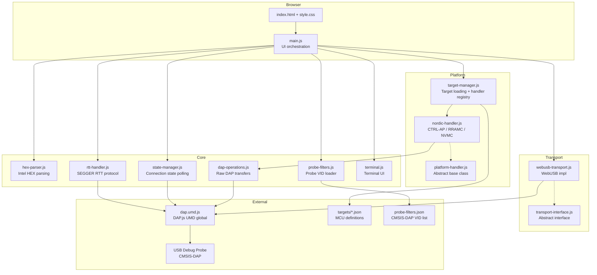
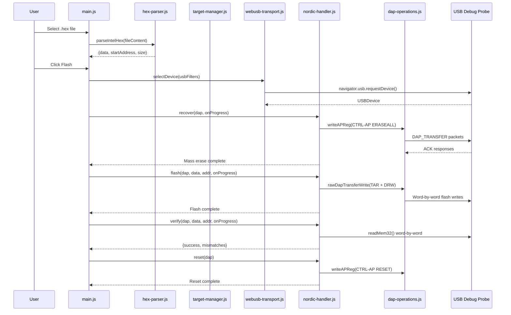

# Production Code Review Checklist

> **Note**: This document is primarily a reference for **AI code reviewers** (Cascade, Copilot, Cursor, etc.).
> Human reviewers do not need to check every item manually — use it as a lookup when reviewing specific areas, or let your AI assistant handle the systematic checks.

Reusable checklist for production-level code reviews of FreeOCD WebDebugger.
Each item has a unique ID for issue/PR cross-referencing.

## Project Context

> **For AI reviewers**: Read this section first to understand the project scope
> before evaluating checklist items.

- **Project**: FreeOCD WebDebugger — browser-based ARM microcontroller debugger
- **Architecture**: Vanilla HTML + ES Modules static site; no build tools except DAP.js rollup
- **Key technologies**: WebUSB, CMSIS-DAP (via DAP.js UMD), Intel HEX parsing, ARM Debug Access Port
- **Browsers**: Chromium-only (Chrome, Edge) — WebUSB required
- **License**: BSD-3-Clause (FreeOCD), MIT (DAP.js)
- **Source modules** (all in `public/js/`):
  - `main.js` — Entry point, UI orchestration, operation runners (flash/recover), RTT / advanced-debug handlers
  - `core/hex-parser.js` — Intel HEX format parser (user file input)
  - `core/dap-operations.js` — Raw CMSIS-DAP transfer operations, register read/write
  - `core/probe-filters.js` — Loader for the central CMSIS-DAP probe vendor ID list
  - `core/rtt-handler.js` — SEGGER RTT control-block scan + up/down buffer I/O
  - `core/state-manager.js` — Polling-based device/RTT connection state machine with event listeners
  - `core/terminal.js` — Minimal terminal UI for RTT (no external dependencies)
  - `transport/transport-interface.js` — Abstract transport interface
  - `transport/webusb-transport.js` — WebUSB transport implementation
  - `platform/platform-handler.js` — Abstract platform handler base class
  - `platform/nordic-handler.js` — Nordic CTRL-AP recovery, RRAMC/NVMC flash, verify
  - `platform/target-manager.js` — Target index/config loading, handler instantiation
- **Target definitions**: `public/targets/index.json` + `public/targets/<platform>/<family>/<mcu>.json`
- **Probe filter list**: `public/targets/probe-filters.json` (central CMSIS-DAP VID whitelist, orthogonal to target MCUs)
- **External dependency**: `vendor/dapjs/` git submodule → built to `public/lib/dap.umd.js` (gitignored)

### Architecture Diagram

### Data Flow: Flash Operation

## How to Use This Checklist

### For Human Reviewers
Copy the tables into a GitHub Issue or PR comment. Fill the **Status** column:
✅ pass | ⚠️ minor issue | ❌ must fix | ➖ not applicable

### For AI Reviewers (Cascade, Copilot, Cursor, etc.)
1. Read the **Project Context** above and the **Glossary** at the end
2. For each checklist item, read the **Key Files** and **Verification** columns to know where to look and how to verify
3. Use the **Priority** column to triage findings: fix `Critical` and `High` items first
4. When reporting findings, reference the checklist **ID** (e.g., "SEC-02 violation in hex-parser.js:15")
5. Items marked with 🤖 in the Verification column are especially suitable for automated/AI-assisted checking

### Priority Levels
| Priority | Meaning | Action |
|----------|---------|--------|
| **Critical** | Security vulnerability, device damage, or data loss | Must fix before release |
| **High** | Significant bug, reliability issue, or missing validation | Should fix before release |
| **Medium** | Code quality, maintainability, or minor UX issue | Fix in current or next cycle |
| **Low** | Style, documentation, or nice-to-have improvement | Fix when convenient |

---

## 1. Security (SEC)

| ID | Priority | Check | Details | Key Files | Verification | Status |
|----|----------|-------|---------|-----------|--------------|--------|
| SEC-01 | Critical | HEX file input validation | `parseIntelHex()` validates checksums, record types, and data lengths. Malformed HEX files must not crash the app or produce corrupt firmware. Empty files, binary garbage, and extremely large files handled gracefully. | `hex-parser.js` | 🤖 Review parser for unchecked array access, integer overflow, missing bounds checks on `byteCount` and address calculations | |
| SEC-02 | High | JSON parse safety | All `JSON.parse()` and `fetch().json()` calls for target configs wrapped in try/catch. Malformed target JSON must not crash the application. | `target-manager.js`, `main.js` | 🤖 Grep for `JSON.parse` and `.json()` and verify each is inside try/catch | |
| SEC-03 | High | DOM injection prevention | User-controlled data (device name, file name, error messages) inserted via `textContent`, never `innerHTML`. Log output uses `createElement` + `textContent`. Step progress uses `innerHTML` but only with internally-generated step names. | `main.js` | 🤖 Grep for `innerHTML` assignments; verify no user/device data flows into `innerHTML` | |
| SEC-04 | High | WebUSB filter validation | USB vendor ID filters from `public/targets/probe-filters.json` validated before passing to `navigator.usb.requestDevice()`. Invalid or missing filters must not cause undefined behavior. When `skipProbeCheck` is enabled, the filter list is intentionally bypassed and the warning banner is shown. | `core/probe-filters.js`, `transport/webusb-transport.js`, `public/targets/probe-filters.json` | 🤖 Verify `parseInt()` result checked for `NaN`; verify invalid entries are skipped with a `console.warn`; verify Product String check is performed unless `skipProbeCheck` is set | |
| SEC-05 | Medium | Address range validation | Flash `startAddress` and firmware `size` from HEX parsing validated against target's flash memory region (`flash.address`, `flash.size`). Writes outside flash region could damage the device. | `main.js`, `nordic-handler.js` | Review whether firmware address is bounds-checked against target flash region before write | |
| SEC-06 | Medium | Integer overflow in address math | Extended address calculations in HEX parser use bitwise shifts (`<< 4`, `<< 16`). Values must stay within safe integer range. DAP register address arithmetic must not wrap. | `hex-parser.js`, `dap-operations.js` | 🤖 Review shift operations for potential 32-bit overflow; verify no negative results | |
| SEC-07 | Medium | No external network requests | Application must not make network requests to external servers. Only `fetch()` calls should be to local `targets/*.json` files. | All `public/js/` files | 🤖 Grep for `fetch`, `XMLHttpRequest`, `WebSocket`; verify all URLs are relative paths | |
| SEC-08 | Medium | Dependency audit | `npm audit` run on both root dev dependencies and `vendor/dapjs`. Known issues documented. | `package-lock.json`, `vendor/dapjs/package-lock.json` | Run `npm audit` in both directories | |
| SEC-09 | Critical | No hardcoded secrets | No tokens, keys, or credentials anywhere in the codebase. | All files | 🤖 Grep for patterns: API keys, tokens, passwords, Bearer, authorization headers | |
| SEC-10 | High | DAP response validation | All DAP transfer responses validated for expected length, command byte, transfer count, and ACK value. Short or malformed responses must not cause out-of-bounds reads. | `dap-operations.js` | 🤖 Verify `response.byteLength` check before `getUint8()` calls; verify all ACK values handled | |

## 2. Stability (STA)

| ID | Priority | Check | Details | Key Files | Verification | Status |
|----|----------|-------|---------|-----------|--------------|--------|
| STA-01 | Critical | Operation concurrency guard | `isOperationInProgress` flag prevents overlapping flash/recover operations. Flag set in try and cleared in `finally`. Concurrent button clicks silently ignored. | `main.js` | 🤖 Verify `isOperationInProgress` set before async work and cleared in `finally`; verify both `runFlash()` and `runRecover()` check it | |
| STA-02 | High | DAP disconnect in error paths | DAP connection always disconnected in catch/finally blocks. Failed operations must not leave USB device in a claimed state that blocks subsequent attempts. | `main.js`, `nordic-handler.js` | 🤖 Verify `dap.disconnect()` in all error paths; verify `try { await dap.disconnect() } catch` pattern | |
| STA-03 | High | WebUSB error recovery | `navigator.usb.requestDevice()` rejection (user cancelled, no device) handled gracefully. `NotFoundError` produces user-friendly message. | `webusb-transport.js` | 🤖 Verify `error.name === 'NotFoundError'` check; verify other error types re-thrown | |
| STA-04 | High | Flash controller timeout | RRAMC/NVMC ready-wait loops have bounded retries (100 iterations). Timeout produces warning, not crash. | `nordic-handler.js` | 🤖 Verify `retries < 100` bound in `_initRRAMC()` and `_initNVMC()`; verify timeout logged | |
| STA-05 | High | Mass erase timeout | `_attemptEraseAll()` has bounded timeout (300 iterations) for both BUSY and READYTORESET states. Includes fallback reconnect-and-retry logic. | `nordic-handler.js` | 🤖 Verify timeout bounds; verify fallback erase path | |
| STA-06 | Medium | Reset fallback chain | `reset()` tries CTRL-AP reset first, falls back to `dap.reset()`. Both failures logged without crashing. | `nordic-handler.js` | 🤖 Verify nested try/catch in `reset()` | |
| STA-07 | Medium | FileReader error handling | `FileReader.onload` error handling covers `parseIntelHex()` exceptions. `FileReader.onerror` should also be handled. | `main.js` | 🤖 Verify `reader.onerror` handler exists | |
| STA-08 | Medium | Graceful degradation | Application detects missing WebUSB support and disables controls with clear message. Application starts even if target index fails to load. | `main.js` | 🤖 Verify `WebUSBTransport.isSupported()` check disables UI; verify `loadTargetIndex()` failure is caught | |
| STA-09 | Low | UI reset after timeout | Step progress UI reset after 3-second timeout via `setTimeout(resetStepProgress, 3000)`. Timer should not leak if user starts a new operation. | `main.js` | Review whether overlapping operations could conflict with pending reset timer | |
| STA-10 | Medium | Reconnect resilience | `recover()` handles `dap.reconnect()` failure gracefully with warning. Does not abort the entire operation on reconnect failure. | `nordic-handler.js` | 🤖 Verify reconnect in try/catch in `recover()` and `_verifyRecovery()` | |

## 3. Browser & Platform Compatibility (PLT)

| ID | Priority | Check | Details | Key Files | Verification | Status |
|----|----------|-------|---------|-----------|--------------|--------|
| PLT-01 | Critical | WebUSB feature detection | `navigator.usb` checked before any WebUSB call. Clear error message for unsupported browsers (Safari, Firefox). Controls disabled when unsupported. | `webusb-transport.js`, `main.js` | 🤖 Verify `isSupported()` called during init; verify UI disabled path | |
| PLT-02 | High | ES Module support | All JS files use ES Module `import`/`export`. `<script type="module">` in HTML. Browsers without ES Module support show blank page — this is acceptable but should be documented. | `index.html`, all `.js` files | 🤖 Verify `type="module"` on script tag; verify no `require()` in browser code | |
| PLT-03 | High | DAPjs UMD global | `DAPjs` loaded as UMD global via `<script type="text/javascript">`. Script order matters: `dap.umd.js` must load before `main.js` module. | `index.html` | 🤖 Verify script order: `dap.umd.js` before `main.js` | |
| PLT-04 | Medium | HEX line endings | `parseIntelHex()` splits on `\r?\n` to handle both Unix and Windows line endings. | `hex-parser.js` | 🤖 Verify regex handles `\r\n`, `\n`, and `\r` | |
| PLT-05 | Medium | CSS compatibility | CSS uses `accent-color`, `gap`, `flex-wrap` — all modern browser features. No vendor prefixes needed for Chromium-only target. | `style.css` | Verify no CSS features require prefixes for Chrome/Edge | |
| PLT-06 | Low | Mobile responsiveness | Layout uses `max-width: 800px` with `width: 90%` for modals. Adequate for desktop Chromium; mobile WebUSB support is limited. | `style.css`, `index.html` | Visual review on narrow viewport | |
| PLT-07 | High | DAPjs version compatibility | `DAPjs.ADI` and `DAPjs.WebUSB` constructors match the built version of DAP.js. Submodule pinned to a known-good commit. | `vendor/dapjs/`, `platform-handler.js`, `webusb-transport.js` | 🤖 Verify submodule commit; verify API usage matches DAP.js exports | |
| PLT-08 | Low | Offline capability | Application works offline once loaded (all assets are local). Target JSON fetched via relative paths. No CDN dependencies. | `index.html`, `target-manager.js` | Verify no external URLs in HTML/CSS/JS (except GitHub links in footer) | |

## 4. Reliability (REL)

| ID | Priority | Check | Details | Key Files | Verification | Status |
|----|----------|-------|---------|-----------|--------------|--------|
| REL-01 | High | DAP transfer retry logic | `readAPReg()` and `writeAPReg()` retry up to 3 times with 50ms delay. Transport-level errors retried; final failure re-thrown. | `dap-operations.js` | 🤖 Verify retry loop bounds and delay; verify final throw | |
| REL-02 | High | Mass erase retry with reconnect | First erase attempt failure triggers reconnect + retry. Both attempts failing produces clear error. | `nordic-handler.js` | 🤖 Verify `_attemptEraseAll()` called twice with reconnect between | |
| REL-03 | High | Fresh DAP connection for flash | After mass erase, creates a new `DAPjs.ADI` instance to avoid stale DAP cache state. | `main.js`, `platform-handler.js` | 🤖 Verify `createFreshDap()` called between recover and flash | |
| REL-04 | Medium | Progress callback safety | `onProgress()` called with values 0–100. Callbacks must not throw (would abort the operation). | `nordic-handler.js`, `main.js` | 🤖 Verify progress values are in [0, 100]; verify callback is simple DOM update | |
| REL-05 | Medium | Verify mismatch limiting | Verification logs first 5 mismatches only to avoid log flooding. Total count still reported. | `nordic-handler.js` | 🤖 Verify `mismatchCount <= 5` guard on logging | |
| REL-06 | Low | UI yield during verify | `verify()` yields to UI event loop every 256 words via `setTimeout(r, 0)`. Prevents browser "page unresponsive" during long verifications. | `nordic-handler.js` | 🤖 Verify yield pattern exists in verify loop | |
| REL-07 | Medium | TAR auto-increment boundary | TAR register updated every 1KB boundary (`address & 0x3FF === 0`) to respect MEM-AP auto-increment wrapping. | `nordic-handler.js` | 🤖 Verify 0x3FF mask for 1KB boundary detection | |
| REL-08 | Medium | Proxy/transport discovery | `getProxy()` and `getTransport()` traverse object properties dynamically (DAP.js minified names). Must handle case where expected property not found. | `dap-operations.js` | 🤖 Verify null check on `getTransport()` return; verify `getProxy()` throws on failure | |

## 5. Performance (PRF)

| ID | Priority | Check | Details | Key Files | Verification | Status |
|----|----------|-------|---------|-----------|--------------|--------|
| PRF-01 | Medium | Log buffer growth | Log entries appended via `appendChild()` without limit. Long operations could accumulate thousands of entries. | `main.js` | Consider adding a max log entry cap or virtual scrolling | |
| PRF-02 | Medium | Word-by-word flash | Firmware written one 32-bit word per DAP transfer. Consider batching multiple words per packet for speed (DAP_TRANSFER supports multiple operations). | `nordic-handler.js` | Review whether transfer batching could improve flash speed | |
| PRF-03 | Low | Word-by-word verify | Verification reads one word at a time via `readMem32()`. Consider using `transferBlock()` for bulk reads. | `nordic-handler.js` | Review whether block transfers could improve verify speed | |
| PRF-04 | Low | Lazy target loading | Target configs loaded on-demand when selected (not all at init). Good for scalability. | `target-manager.js` | 🤖 Verify `loadTarget()` called only on selection change | |
| PRF-05 | Low | No unnecessary reflows | Step progress updates use targeted DOM mutations (`style.width`, `textContent`). No layout thrashing. | `main.js` | Review step progress updates for reflow triggers | |

## 6. Readability & Code Organization (RDO)

| ID | Priority | Check | Details | Key Files | Verification | Status |
|----|----------|-------|---------|-----------|--------------|--------|
| RDO-01 | Medium | Module decomposition | Single-responsibility modules. Transport, platform, and core layers cleanly separated. No circular imports. | `public/js/` directory | 🤖 Analyze import graph; detect circular dependencies | |
| RDO-02 | Medium | Abstract class enforcement | `PlatformHandler` and `TransportInterface` throw on direct instantiation via `new.target` check. Abstract methods throw "must be implemented". | `platform-handler.js`, `transport-interface.js` | 🤖 Verify `new.target` guard in constructors | |
| RDO-03 | Low | Naming conventions | camelCase: variables/functions. PascalCase: classes. UPPER_SNAKE_CASE: constants. `_` prefix: private methods. | All `public/js/` files | 🤖 Run ESLint; spot-check naming | |
| RDO-04 | Low | Constants centralization | DAP register constants in `dap-operations.js`. CTRL-AP offsets in `nordic-handler.js`. No magic numbers in business logic. | `dap-operations.js`, `nordic-handler.js` | 🤖 Grep for hex/numeric literals not declared as named constants | |
| RDO-05 | Low | JSDoc comments | All exported functions and classes have JSDoc-style comments with `@param` and `@returns`. | All `public/js/` files | 🤖 Grep for exported functions without comments | |
| RDO-06 | Low | ESLint clean | `npm run lint` passes with zero errors and zero warnings. Abstract method parameters and silent catch bindings follow the `_` prefix convention recognized by ESLint's `argsIgnorePattern` / `caughtErrorsIgnorePattern`. | All `public/js/` files | Run `npm run lint` | |
| RDO-07 | Low | Module size | Flag modules exceeding ~500 lines for potential splitting. `main.js` (~1770 lines) hosts UI orchestration, flash/recover runners, RTT, and advanced-debug handlers and is a candidate for future decomposition; `nordic-handler.js` (~550 lines) is also at the boundary. | `public/js/` directory | 🤖 Count lines per module | |

## 7. Documentation Currency (DOC)

| ID | Priority | Check | Details | Key Files | Verification | Status |
|----|----------|-------|---------|-----------|--------------|--------|
| DOC-01 | Medium | README features list | All features listed in README exist in code. No vaporware. Supported targets table matches `targets/index.json`. | `README.md`, `targets/index.json` | 🤖 Cross-reference feature list with actual implementations | |
| DOC-02 | Medium | Project structure diagram | `Project Structure` in README matches actual file layout. New files and directories reflected. | `README.md` | 🤖 Compare tree with actual `public/` directory | |
| DOC-03 | Medium | Build instructions | Clone & Build steps in README and CONTRIBUTING.md work in a clean environment. | `README.md`, `CONTRIBUTING.md` | Run steps in a fresh clone | |
| DOC-04 | Medium | Contributing guide | Code style, PR workflow, extension points (new target/platform/transport) match current codebase. | `CONTRIBUTING.md` | Cross-reference with actual module structure | |
| DOC-05 | Low | Architecture diagrams | Mermaid diagrams in this checklist match current module structure and data flow. | `AI_REVIEW.md` | Compare diagram nodes with actual imports | |
| DOC-06 | Low | Inline code comments | Comments in `dap-operations.js` and `nordic-handler.js` explain "why" for non-obvious DAP workarounds. Attribution comments present for derived code. | `dap-operations.js`, `nordic-handler.js` | Review comments for accuracy | |

## 8. Error Handling & Logging (ERR)

| ID | Priority | Check | Details | Key Files | Verification | Status |
|----|----------|-------|---------|-----------|--------------|--------|
| ERR-01 | High | User-facing errors | All operation failures produce `log(message, 'error')` with actionable text. Status indicator updates to reflect failure state. | `main.js` | 🤖 Verify all catch blocks call `log()` and `updateStatus()` | |
| ERR-02 | Medium | Error message clarity | Error messages include context (what was being attempted) and guidance (what to try next). No raw stack traces shown to user. | `main.js`, `nordic-handler.js` | Review error messages for user-friendliness | |
| ERR-03 | Medium | Warning vs Error | `log(msg, 'warning')` for recoverable issues (reconnect needed, IDR mismatch). `log(msg, 'error')` for blocking failures. | `nordic-handler.js` | Review log severity classification | |
| ERR-04 | Low | Silent catch justification | `catch (_) { /* ignore */ }` in disconnect-on-error paths justified (cleanup, not primary operation). | `main.js` | 🤖 Grep for empty catch blocks; verify each has justification comment | |
| ERR-05 | Medium | Error typing | `error.message` accessed without `instanceof Error` guard. If non-Error is thrown, `error.message` would be `undefined`. | All `public/js/` files | 🤖 Grep for `error.message` without `instanceof Error` guard | |

## 9. CI/CD Pipeline (CIC)

| ID | Priority | Check | Details | Key Files | Verification | Status |
|----|----------|-------|---------|-----------|--------------|--------|
| CIC-01 | High | Least-privilege permissions | Default `contents: read`. `contents: write` only in release publish job. No unnecessary token scopes. | `ci.yml`, `release.yml` | 🤖 Review `permissions` blocks in all workflows | |
| CIC-02 | High | Release pipeline stages | Lint → Build → Publish pipeline. Each stage gates the next via `needs`. | `release.yml` | 🤖 Verify `needs` dependency chain | |
| CIC-03 | Medium | Build artifact verification | Built `dap.umd.js` verified for minimum file size (not suspiciously small). | `ci.yml`, `release.yml` | 🤖 Verify `stat -c%s` check with threshold | |
| CIC-04 | Medium | Concurrency control | CI uses `cancel-in-progress: true`. Release uses `cancel-in-progress: false`. | `ci.yml`, `release.yml` | 🤖 Verify `concurrency` blocks | |
| CIC-05 | Medium | Matrix builds | DAP.js build verified on Node.js 22 and 24 in CI. Release workflow builds on Node.js 20 (minimum supported version documented in README). | `ci.yml`, `release.yml` | 🤖 Verify matrix definition covers the CI compat versions; verify release Node version matches the README "Prerequisites" section | |
| CIC-06 | Medium | Lint coverage | ESLint (JS), HTMLHint (HTML), JSON validation (target files) all run in CI. | `ci.yml`, `release.yml` | 🤖 Verify all three lint steps exist | |
| CIC-07 | Low | SHA256 checksums | Release archive accompanied by `checksums-sha256.txt`. | `release.yml` | 🤖 Verify `sha256sum` step exists | |
| CIC-08 | Low | Node version policy | Node versions follow a documented split: CI matrix runs forward-compat testing on recent LTS versions (currently 22, 24), while `release.yml` uses the minimum supported version (currently 20) declared in README. The artifact upload in CI must select one matrix leg to avoid duplicate-name collisions. | `ci.yml`, `release.yml`, `README.md` | 🤖 Verify the CI matrix and release Node version are both listed; verify the upload-artifact step's `if:` condition matches one entry in the CI matrix | |
| CIC-09 | Medium | GITHUB_STEP_SUMMARY | Lint results and build artifacts summarized in workflow summary. | `ci.yml`, `release.yml` | 🤖 Verify `GITHUB_STEP_SUMMARY` usage | |

## 10. Dependency Management (DEP)

| ID | Priority | Check | Details | Key Files | Verification | Status |
|----|----------|-------|---------|-----------|--------------|--------|
| DEP-01 | High | Lock file committed | `package-lock.json` committed and consistent with `package.json`. `npm ci` works in clean env. | `package-lock.json` | Run `npm ci` in a clean clone | |
| DEP-02 | High | Submodule hygiene | `vendor/dapjs` submodule pinned to specific commit. `.gitmodules` path correct. | `.gitmodules`, `vendor/dapjs` | 🤖 Verify `.gitmodules` entry; run `git submodule status` | |
| DEP-03 | Medium | Dev/prod separation | Root `package.json` contains only `devDependencies` (lint tools). No runtime dependencies — DAP.js built from submodule. | `package.json` | 🤖 Verify no `dependencies` section in root package.json | |
| DEP-04 | Medium | DAPjs build reproducibility | `vendor/dapjs` build (`npm install && npm run build`) produces identical `dap.umd.js` output across Node versions. | `vendor/dapjs/` | Build on Node 20 and 22; diff outputs | |
| DEP-05 | Low | Version ranges | Root devDependencies use caret (`^`) ranges. No wildcard (`*`) or exact versions without justification. | `package.json` | 🤖 Review version range specifiers | |

## 11. Accessibility (A11Y)

| ID | Priority | Check | Details | Key Files | Verification | Status |
|----|----------|-------|---------|-----------|--------------|--------|
| A11Y-01 | Medium | Semantic HTML | Form controls have associated `<label>` elements. Buttons have descriptive text. | `index.html` | 🤖 Verify all `<input>` and `<select>` have matching `<label for="">` | |
| A11Y-02 | Medium | Keyboard accessibility | All interactive elements (buttons, select, file input, checkbox) are standard HTML controls — keyboard accessible by default. | `index.html` | Test all operations via keyboard only | |
| A11Y-03 | Medium | Status announcements | Device status and operation results communicated via text, not color alone. Status indicator has adjacent text label. | `index.html`, `main.js` | 🤖 Verify `deviceStatus` text element accompanies color indicator | |
| A11Y-04 | Low | Color contrast | Text contrast ratios meet WCAG AA (4.5:1). Dark theme: `#eaeaea` on `#1a1a2e` ≈ 11:1 — passes. | `style.css` | Check contrast ratios for all text/background combinations | |
| A11Y-05 | Low | Modal focus trap | Disclaimer modal should trap focus. Currently uses CSS `pointer-events: none` on background — keyboard users could tab past the modal. | `index.html`, `main.js`, `style.css` | Test modal with keyboard-only navigation | |

## 12. License & Attribution (LIC)

| ID | Priority | Check | Details | Key Files | Verification | Status |
|----|----------|-------|---------|-----------|--------------|--------|
| LIC-01 | High | License file | `LICENSE` contains BSD-3-Clause full text. | `LICENSE` | 🤖 Verify license text matches BSD-3-Clause template | |
| LIC-02 | High | DAP.js license distribution | `dapjs-LICENSE.txt` copied to `public/lib/` during build. Link in footer points to it. | `ci.yml`, `release.yml`, `index.html` | 🤖 Verify copy step in workflows; verify footer link | |
| LIC-03 | Medium | Derived code attribution | Files derived from `xiao-nrf54l15-web-flasher` include BSD-3-Clause attribution comment at file top. | `dap-operations.js`, `nordic-handler.js` | 🤖 Verify attribution comments in derived files | |
| LIC-04 | Medium | No unnecessary copyright | Files containing only original code do not include third-party copyright notices. | `main.js`, `hex-parser.js`, `target-manager.js`, `style.css` | 🤖 Verify no misplaced third-party notices | |
| LIC-05 | Low | Third-party license compatibility | All dependencies have licenses compatible with BSD-3-Clause. | `package.json`, `vendor/dapjs/package.json` | Run `npx license-checker` or review manually | |

## 13. Repository Hygiene (REP)

| ID | Priority | Check | Details | Key Files | Verification | Status |
|----|----------|-------|---------|-----------|--------------|--------|
| REP-01 | Medium | .gitignore coverage | Build artifacts (`public/lib/`), `node_modules/`, OS files, editor files ignored. | `.gitignore` | 🤖 Verify patterns cover all generated files | |
| REP-02 | Low | No large binary files | Repository does not contain unnecessary binaries. `dap.umd.js` is gitignored, built in CI. | Repository | 🤖 Find files > 1MB in the repository | |
| REP-03 | Low | Commit message convention | Commits follow a consistent format. PR descriptions reference checklist IDs where applicable. | Git history | Review recent commit messages | |
| REP-04 | Low | Branch protection | `main` branch requires PR reviews and passing CI before merge. | GitHub settings | Verify branch protection rules in repo settings | |

## 14. Privacy & Data Handling (PRI)

| ID | Priority | Check | Details | Key Files | Verification | Status |
|----|----------|-------|---------|-----------|--------------|--------|
| PRI-01 | High | No telemetry | Application does not collect or transmit telemetry, analytics, or usage data. No external network requests. | All files | 🤖 Grep for outbound network calls, tracking pixels, analytics SDKs | |
| PRI-02 | Medium | No data persistence | Application does not store firmware files, device info, or operation logs in `localStorage`, `IndexedDB`, or cookies. All data is session-only. | All `public/js/` files | 🤖 Grep for `localStorage`, `sessionStorage`, `IndexedDB`, `document.cookie` | |
| PRI-03 | Low | Firmware data handling | User's firmware file read into memory only during the operation. Not cached or transmitted elsewhere. | `main.js` | Verify `parsedFirmware` is only used locally; cleared on new file selection | |

## 15. Hardware Safety (HW)

> **Unique to this project**: Operations directly modify microcontroller hardware.

| ID | Priority | Check | Details | Key Files | Verification | Status |
|----|----------|-------|---------|-----------|--------------|--------|
| HW-01 | Critical | Disclaimer gate | All destructive operations (flash, recover) blocked until user accepts disclaimer. `pointer-events: none` and `disabled` attributes enforced. | `index.html`, `main.js` | 🤖 Verify `disabled` on all buttons at page load; verify disclaimer acceptance enables UI | |
| HW-02 | Critical | Mass erase warning | Warning box clearly states operations will erase all data. Recover button labeled "Recover (Mass Erase)" explicitly. | `index.html` | Visual review of warning and button text | |
| HW-03 | High | Correct AP targeting | CTRL-AP number from target JSON matches the actual device. IDR verification warns on mismatch but proceeds (device may be locked). | `nordic-handler.js` | 🤖 Verify IDR check exists in `recover()`; verify warning on mismatch | |
| HW-04 | High | Flash controller init verification | RRAMC/NVMC configuration register read-back verified after write. Warning logged if WEN bit not set. | `nordic-handler.js` | 🤖 Verify read-back check in `_initRRAMC()` | |
| HW-05 | Medium | Device reset after erase | Device reset performed after mass erase to bring it to a known state. Multiple reset mechanisms attempted. | `nordic-handler.js` | 🤖 Verify CTRL-AP reset sequence: write 2, sleep, write 0 | |
| HW-06 | Medium | Post-erase verification | After recovery, device accessibility verified (IDR readable, erase protect status checked). | `nordic-handler.js` | 🤖 Verify `_verifyRecovery()` called after erase | |
| HW-07 | Low | Sleep timing | Sleep durations between DAP operations are sufficient for target device state transitions. Too-short sleeps may cause state machine errors. | `nordic-handler.js`, `main.js` | Review sleep durations against datasheet timing requirements | |

---

## Glossary

> **For AI reviewers**: These terms have specific meanings in this project.

| Term | Definition |
|------|------------|
| **CMSIS-DAP** | Cortex Microcontroller Software Interface Standard — Debug Access Port. USB protocol for ARM debug probes |
| **DAP.js** | JavaScript library providing CMSIS-DAP protocol implementation over WebUSB. Loaded as UMD global `DAPjs` |
| **ADI** | ARM Debug Interface — top-level debug access provided by `DAPjs.ADI` class |
| **DP** | Debug Port — the on-chip debug port accessed via CMSIS-DAP |
| **AP** | Access Port — sub-ports on the debug interface. MEM-AP (AP #0) for memory access, CTRL-AP for platform-specific control |
| **CTRL-AP** | Control Access Port — Nordic-specific AP for mass erase, reset, and protection management |
| **MEM-AP** | Memory Access Port — standard ARM AP for reading/writing target memory |
| **TAR** | Transfer Address Register — MEM-AP register holding the current memory address |
| **DRW** | Data Read/Write Register — MEM-AP register for reading/writing the word at TAR address |
| **CSW** | Control/Status Word — MEM-AP register configuring access size and auto-increment |
| **RRAMC** | Resistive RAM Controller — flash memory controller on Nordic nRF54 series |
| **NVMC** | Non-Volatile Memory Controller — flash memory controller on Nordic nRF52 series |
| **Intel HEX** | Text-based file format for binary firmware images. Records start with `:` and include address, data, and checksum |
| **WebUSB** | Browser API for direct USB device access. Chromium-only (Chrome, Edge) |
| **UMD** | Universal Module Definition — JavaScript module format compatible with `<script>` tags (global), CommonJS, and AMD |
| **TOCTOU** | Time-of-check to time-of-use — race condition class |
| **ACK** | Acknowledge — DAP transfer response indicating success (0x01), WAIT (0x02), or FAULT (0x04) |

---

## Revision History

| Date | Version | Changes |
|------|---------|---------|
| 2026-04-18 | 1.0 | Initial checklist: 15 categories, 95 items |
| 2026-04-19 | 1.1 | v0.0.2 docs refresh: added `probe-filters.js`, `rtt-handler.js`, `state-manager.js`, `terminal.js` to the source module list and architecture diagram; updated SEC-04 to reference `probe-filters.json`; corrected CIC-05/CIC-08 Node.js matrix versions and RDO-07 line-count figures; tightened RDO-06 to the new zero-warnings ESLint baseline |
